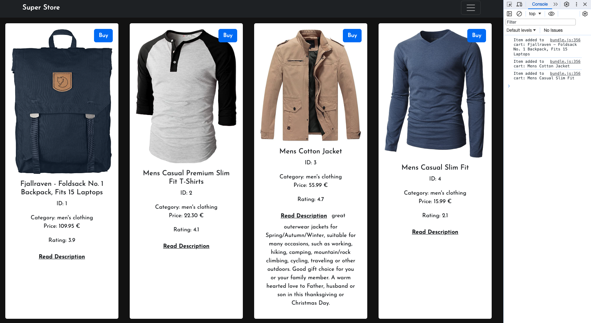

# React App - Shopping Items

This is a very simple app, that gathers data from the [Fake Store API](https://fakestoreapi.com/) and displays it as a list of products to buy, as a fake store.

This is a project done for the Web Development program [@Helsinki Business School](https://en.bc.fi) (Aug/Sept) 2023). The main focus was to start using Bootstrap and recap on previosu react work, including Axios.

The project has a tracking method throgh console log, as means to track the items clicked with the "buy" button. Next step was to build this app with redux and add a visible shooping cart, but that's a different project.

## Technologies

- Reactjs
- Bootstrap
- Axios

## Set up

```shell
npm install
npm start
```

## Screnshoot


## Credits

The assignment, inital codebase and guidance were provided by [Martin Holland](https://github.com/martin-holland) during Sep/Oct 2023 [@Helsinki Business College](https://en.bc.fi).

Shopping data provided by [Fake Store API](https://fakestoreapi.com/)

Images provided by [pexels.com](https://www.pexels.com/)

Favicon is from [unicode.org](https://unicode.org/emoji/charts/emoji-list.html#1f6d2) (code U+1F6D2)